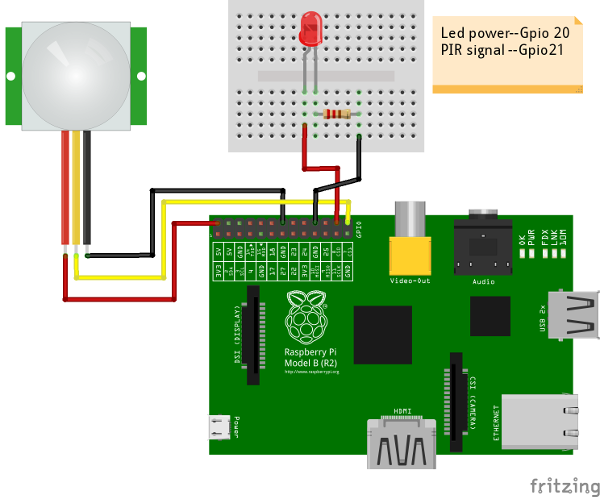

# Pir-NodeJs

Experimentación con un sensor de movimiento PIR conectado a una Raspberry Pi, enviando datos por OSC mediante Node.js y recibiéndolos en OpenFrameworks.

## Descripción del proyecto

Este proyecto muestra cómo:

- Leer un sensor de movimiento PIR desde una Raspberry Pi usando Node.js y la librería `onoff`.
- Encender/apagar un LED según el estado del sensor.
- Enviar el valor leído (0/1) como mensajes OSC usando `osc-min` y `dgram` hacia otro equipo (por ejemplo, una aplicación hecha en OpenFrameworks).

El script principal es:

- `index.js`: configura los pines GPIO (LED y PIR), escucha los cambios del sensor y, cada vez que hay movimiento, envía un mensaje OSC a la IP y puerto configurados.

## Diagrama de conexiones

A nivel de hardware, las conexiones entre el sensor PIR, el LED y la Raspberry Pi se ilustran en el siguiente diagrama:



*(Si ves este proyecto en GitHub, la misma imagen está incluida en el repositorio.)*

## Requisitos

- Raspberry Pi con un sistema basado en Debian (Raspberry Pi OS u otro similar).
- Node.js (recomendado ≥ 7.x; con la versión 0.10 que viene por defecto puede fallar).
- Un sensor de movimiento PIR.
- Un LED (opcional, para feedback visual) con su resistencia.
- Acceso de red entre la Raspberry Pi y el equipo que recibirá los mensajes OSC (por ejemplo, un ordenador con OpenFrameworks).

Dependencias de Node.js (ya listadas en `package.json`):

- `onoff`
- `osc-min`

`index.js` también usa `dgram` (módulo estándar de Node.js para UDP).

## Instalación

1. **Instalar Node.js (si aún no lo tienes actualizado)**

   En Raspberry Pi (ejemplo con NodeSource):

   ```bash
   wget https://deb.nodesource.com/setup_7.x
   sudo -E bash setup_7.x
   sudo apt install -y nodejs
   node -v
   ```

2. **Clonar o copiar este repositorio en la Raspberry Pi**

   ```bash
   cd /RUTA/DONDE/QUIERAS
   git clone https://github.com/Noisk8/Pir-NodeJs.git
   cd Pir-NodeJs
   ```

3. **Instalar dependencias del proyecto**

   (si no se han instalado ya):

   ```bash
   npm install
   ```

   Esto instalará `onoff` y `osc-min` según `package.json`.

## Conexiones de hardware

El código usa los siguientes pines GPIO (numeración BCM):

- `LED` en GPIO 20 (salida)
- `PIR` en GPIO 21 (entrada, con detección en "both" flancos)

Conexión típica:

- Sensor PIR:
  - VCC → 5V o 3.3V de la Raspberry Pi (según el modelo de PIR)
  - GND → GND de la Raspberry Pi
  - OUT → GPIO 21
- LED (opcional):
  - Ánodo (+) → resistencia → GPIO 20
  - Cátodo (–) → GND

La imagen del apartado anterior (`PIR&NodeJS_Pequeña.png`) resume este esquema de cableado.

## Configuración de OSC

En `index.js` se envía un mensaje OSC cuando cambia el valor del PIR:

```js
udp.send(buf, 0, buf.length, 12345, "192.168.0.109");
```

- `12345` es el puerto de destino.
- `192.168.0.109` es la IP del ordenador que recibirá el OSC.

Adáptalos a tu red y a tu aplicación receptora.

### Dirección OSC

El mensaje se envía a la dirección:

- `/PIR`

con un argumento entero (`0` o `1`) que representa el estado actual del sensor.

## Uso

1. Asegúrate de que el cableado del PIR y el LED sea correcto (puedes guiarte por el diagrama de conexiones).
2. Comprueba que la Raspberry Pi y el ordenador receptor estén en la misma red.
3. Edita `index.js` si necesitas cambiar:
   - La IP de destino.
   - El puerto OSC.
   - Los pines GPIO usados.
4. Desde la carpeta del proyecto, ejecuta:

   ```bash
   sudo node index.js
   ```

   Se usa `sudo` porque el acceso a los pines GPIO suele requerir permisos elevados.

5. Mueve algo delante del sensor PIR:
   - Verás en la terminal mensajes tipo `b1` o `b0` según el estado.
   - El LED en GPIO 20 cambiará su estado.
   - Se enviarán mensajes OSC al destino configurado.

Para detener el script, pulsa `Ctrl + C`. El proceso liberará el recurso del PIR (`pir.unexport()`) y saldrá.

## Integración con OpenFrameworks (ejemplo)

En otro equipo, con OpenFrameworks, puedes usar el ejemplo `communication/oscReceiveExample` para recibir los mensajes OSC.

En `ofApp.h` (o el archivo equivalente), define el puerto:

```cpp
// listen on port 12345
#define PORT 12345
```

Asegúrate de que coincida con el puerto configurado en `index.js`.

Mientras `index.js` esté corriendo y enviando mensajes OSC, el ejemplo de OpenFrameworks debería ir recibiendo los cambios del sensor PIR.

## Créditos

Cacharriado por Olivia Jack & Noisk8.

Versión beta 4ever.
